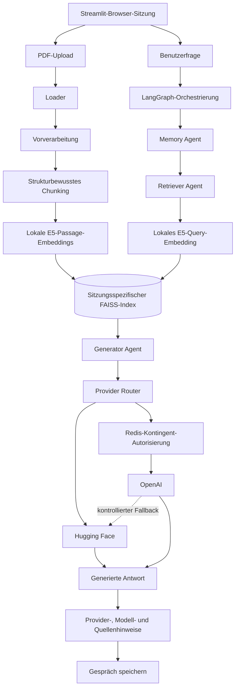

[](https://nlp-multiagent-rag.streamlit.app/)
_Interaktive Web-App direkt im Browser öffnen (via Streamlit Community Cloud)_

# NLP Multi-Agent RAG

**Wahlfachprojekt** im Rahmen des Studiengangs  
**BSc Systemtechnik – Vertiefung Computational Engineering**  
**Frühjahr 2025** – OST – Ostschweizer Fachhochschule  
**Autor:** Rino Albertin  

---

## 📌 Projektbeschreibung

Die Web-App ermöglicht Besucherinnen und Besuchern, eigene PDFs hochzuladen und dazu Fragen auf Deutsch oder Englisch zu stellen. Dokumente werden lokal verarbeitet, mit `intfloat/multilingual-e5-small` eingebettet und über einen sitzungsspezifischen FAISS-Index durchsucht. LangGraph koordiniert Retrieval, Gesprächskontext und Antwortgenerierung. Die Generierung läuft über kontingentgeschütztes OpenAI oder Hugging Face Inference Providers. Uploads, Vektorspeicher und Gesprächsverläufe bleiben zwischen Browser-Sitzungen isoliert. Antworten nennen den verwendeten Provider und das Modell sowie Dokument- und Seitenquellen.

<details>
<summary><strong>Dokumentverarbeitung und Retrieval</strong></summary>

- `pdfplumber` extrahiert Text, Seiten- und Layoutinformationen direkt aus PDF-Dateien.
- Die Vorverarbeitung normalisiert Text, erkennt wiederkehrende Kopf- und Fusszeilen und leitet typografische Strukturmerkmale ab.
- Der Chunker erzeugt deterministische, überlappende Textabschnitte mit Dokument-, Seiten-, Struktur- und Positionsmetadaten.
- `SentenceTransformers` lädt `intfloat/multilingual-e5-small` lokal; E5-konforme Präfixe unterscheiden Passage- und Anfrage-Embeddings.
- Ein sitzungsspezifischer FAISS-Index sucht per L2-Distanz. Explizit gespeicherte Snapshots werden samt Schema, Embedding-Modell, Dimension, Index und Datensätzen validiert und atomar aktiviert.
</details>

<details>
<summary><strong>Multi-Agent-Orchestrierung und Sitzungen</strong></summary>

Der LangGraph-Ablauf orchestriert spezialisierte Rollen in fester Reihenfolge: Der Memory Agent lädt den Verlauf, der Retriever Agent sucht relevante Textstellen, der Generator Agent erzeugt eine Antwort und danach wird der erfolgreiche Dialogzug gespeichert. Das Ergebnis weist den tatsächlich verwendeten Provider und das Modell aus. Dokument- und Seitenquellen erscheinen geordnet nach Retrieval-Relevanz und ohne Duplikate.

Jede Browser-Sitzung besitzt ein isoliertes Upload-Set, einen eigenen FAISS-Speicher und einen eigenen Gesprächsverlauf. Eine geänderte Dokumentauswahl wird erst nach vollständig erfolgreicher Verarbeitung atomar aktiviert. Diese Sitzungsdaten bleiben im Arbeitsspeicher der laufenden Anwendung und sind keine dauerhafte serverseitige Dokumentablage.
</details>

<details>
<summary><strong>Provider-Routing und Kontingentschutz</strong></summary>

`GENERATION_PROVIDER` steuert die Antwortgenerierung. Im Modus `huggingface` wird ausschliesslich Hugging Face verwendet. `auto` bevorzugt OpenAI, sofern Schlüssel und Redis-Kontingent verfügbar sind, und versucht andernfalls oder bei definierten temporären Fehlern einmalig Hugging Face. Im Modus `openai` ist dieser Fallback nur mit `OPENAI_FALLBACK_ENABLED=true` aktiv.

Standardmässig kommen `Qwen/Qwen2.5-7B-Instruct` über Hugging Face und `gpt-5.4-mini` über OpenAI zum Einsatz. Redis autorisiert und begrenzt die OpenAI-Nutzung atomar nach Sitzung, Tag und Monat. Ohne erfolgreiche Autorisierung bleibt OpenAI gesperrt. Öffentliche Besucher benötigen keine eigenen API-Schlüssel.

Die Hugging-Face-Route hängt von gültiger Authentifizierung, verfügbaren Credits, Modellverfügbarkeit und externer Provider-Kapazität ab. Ein Fallback kann daher nicht in jedem Fall eine Antwort garantieren.
</details>


---

## 📄 Projektbericht

Der [ursprüngliche akademische Projektbericht](docs/Albertin_Rino_NLP_Projekt.pdf) dokumentiert Problemstellung, Grundlagen und den Entwicklungsstand des Wahlfachprojekts im Frühjahr 2025. Für den aktuellen ausführbaren Stand sind der Quellcode und diese README massgebend.

---

## 🧭 Architektur und Datenfluss

Dokumentaufnahme und Fragebeantwortung laufen innerhalb einer isolierten Browser-Sitzung zusammen und nutzen denselben sitzungsspezifischen FAISS-Index.

<details>
<summary><strong>Architekturdiagramm anzeigen</strong></summary>



</details>


---

## ⚙️ Ausführung und Deployment

<details>
<summary><strong>Lokale Ausführung und Deployment anzeigen</strong></summary>

### Lokaler Start

Vorausgesetzt werden Git, Python 3.12 und Poetry 2.x.

```bash
git clone https://github.com/Rinovative/nlp-multiagent-rag.git
cd nlp-multiagent-rag
poetry install --with dev
cp .env.template .env
```

Unter PowerShell wird die Vorlage mit `Copy-Item .env.template .env` kopiert.

Für die Hugging-Face-Route mindestens folgende Werte in `.env` setzen:

```dotenv
GENERATION_PROVIDER=huggingface
HUGGINGFACE_API_TOKEN=eigenes_huggingface_token
```

Das Token benötigt die Berechtigung **Make calls to Inference Providers**. Die lokalen Embeddings benötigen keinen API-Schlüssel.

```bash
poetry run streamlit run app.py
```

### Streamlit Community Cloud

Für die Bereitstellung das Repository `Rinovative/nlp-multiagent-rag`, den Branch `main`, den Einstiegspunkt `app.py` und Python 3.12 auswählen. Die benötigten Umgebungsvariablen werden als Streamlit Secrets hinterlegt.

Für Hugging Face werden `GENERATION_PROVIDER` und `HUGGINGFACE_API_TOKEN` benötigt. Der optionale OpenAI-Pfad erfordert zusätzlich `OPENAI_API_KEY` und `REDIS_URL`. Secrets dürfen niemals in Git gespeichert werden.

### Konfiguration

Alle unterstützten Einstellungen und Standardwerte sind in [`.env.template`](.env.template) dokumentiert. Dazu gehören Provider und Modelle, Embeddings, Upload-Limits, Retrieval, Gesprächsverlauf und Zeitlimits.

Im Modus `auto` wird OpenAI nur nach erfolgreicher Redis-Autorisierung verwendet, andernfalls wird kontrolliert auf Hugging Face ausgewichen. Betreiber-Schlüssel bleiben für Besucher unsichtbar.

### OpenAI-Kontingent administrieren

Für den OpenAI-Pfad werden die Produktionslimits einmalig gespeichert und anschliessend aktiviert. `set-limits` aktiviert das Kontingent bewusst noch nicht.

```bash
poetry run python -m src.cli.cli_quota \
  --key-prefix 'nlp-rag:{openai-quota}:prod' \
  set-limits \
  --daily-requests 30 \
  --monthly-requests 300 \
  --daily-tokens 100000 \
  --monthly-tokens 1000000 \
  --session-requests 5 \
  --session-window-seconds 3600

poetry run python -m src.cli.cli_quota \
  --key-prefix 'nlp-rag:{openai-quota}:prod' enable
```

Der aktuelle Zustand lässt sich mit `inspect` prüfen. Mit `disable` kann der OpenAI-Zugang jederzeit sofort deaktiviert werden. Die CLI liest `REDIS_URL` aus `.env` oder über `--redis-url` und gibt keine Zugangsdaten aus.

</details>

---

## 📂 Projektstruktur

<details>
<summary><strong>Projektstruktur anzeigen</strong></summary>

```text
.
├── .github/
│   └── workflows/
│       └── ci.yml                                 # CI für Formatierung, Linting, Typen und Tests
├── docs/
│   └── Albertin_Rino_NLP_Projekt.pdf              # Ursprünglicher akademischer Projektbericht
│
├── src/
│   ├── agents/
│   │   ├── __init__.py                            # Öffentliche Agent-Schnittstellen
│   │   ├── agents_generator.py                    # Antwortgenerierung aus Kontext und Verlauf
│   │   ├── agents_memory.py                       # Zugriff auf den Gesprächsspeicher
│   │   └── agents_retriever.py                    # Anfrage-Embedding und Dokumentabruf
│   ├── application/
│   │   ├── __init__.py                            # Öffentliche Anwendungsschnittstellen
│   │   ├── application_factory.py                 # Verdrahtung von Providern, Agenten und Sitzungen
│   │   └── application_session.py                 # Atomare Upload- und Sitzungsverwaltung
│   ├── cli/
│   │   ├── __init__.py                            # CLI-Paketgrenze
│   │   └── cli_quota.py                           # Betreiber-CLI für OpenAI-Kontingente
│   ├── configuration/
│   │   ├── __init__.py                            # Öffentliche Konfigurationsschnittstellen
│   │   └── configuration_runtime.py               # Validierte Umgebungs- und Secret-Konfiguration
│   ├── embeddings/
│   │   ├── __init__.py                            # Öffentliche Embedding-Schnittstellen
│   │   ├── embeddings_chunks.py                   # Embedding-Anreicherung von Chunks
│   │   ├── embeddings_contracts.py                # Typisierte Provider-Verträge
│   │   └── embeddings_sentence_transformer.py     # Lokaler SentenceTransformers-Provider
│   ├── ingestion/
│   │   ├── __init__.py                            # Öffentliche Ingestion-Schnittstellen
│   │   ├── ingestion_chunker.py                   # Strukturbewusstes Chunking
│   │   ├── ingestion_loader.py                    # PDF-Extraktion mit pdfplumber
│   │   ├── ingestion_preprocessing.py             # Text- und Layout-Vorverarbeitung
│   │   └── ingestion_processor.py                 # Orchestrierung der Dokumentaufnahme
│   ├── memory/
│   │   ├── __init__.py                            # Öffentliche Memory-Schnittstellen
│   │   ├── memory_contracts.py                    # Vertrag für Gesprächsspeicher
│   │   └── memory_in_memory.py                    # Sitzungsspezifischer Arbeitsspeicher
│   ├── orchestration/
│   │   ├── __init__.py                            # Öffentliche Orchestrierungsoberfläche
│   │   └── orchestration_rag.py                   # Typisierter LangGraph-RAG-Ablauf
│   ├── providers/
│   │   ├── __init__.py                            # Öffentliche Provider-Schnittstellen
│   │   ├── providers_contracts.py                 # Ergebnisse, Fehler und Provider-Verträge
│   │   ├── providers_generation_huggingface.py    # Hugging-Face-Generierungsprovider
│   │   ├── providers_generation_openai.py         # OpenAI-Generierungsprovider
│   │   └── providers_router.py                    # Routing, Kontingente und begrenzter Fallback
│   ├── quota/
│   │   ├── __init__.py                            # Öffentliche Kontingent-Schnittstellen
│   │   ├── quota_contracts.py                     # Limits, Reservierungen und Fehler
│   │   ├── quota_memory.py                        # Deterministisches In-Memory-Backend
│   │   └── quota_redis.py                         # Atomares Redis-Backend mit Lua
│   ├── vectorstore/
│   │   ├── __init__.py                            # Öffentliche Vektorspeicher-Schnittstellen
│   │   └── vectorstore_faiss.py                   # FAISS-Suche und validierte Snapshots
│   └── __init__.py                                # Importierbares Top-Level-Paket
│
├── tests/                                         # Deterministische Tests für Anwendung, Ingestion, Provider, Kontingente, Sessions und Vektorspeicher
├── .env.template                                  # Dokumentierte Konfigurationsvorlage
├── .gitignore                                     # Ausgeschlossene lokale Artefakte
├── .pre-commit-config.yaml                        # Lokale Qualitätsprüfungen
├── app.py                                         # Streamlit-Einstiegspunkt im Repository-Stamm
├── LICENSE                                        # MIT-Lizenz
├── poetry.lock                                    # Aufgelöste Abhängigkeiten
├── pyproject.toml                                 # Projekt-, Tool- und Abhängigkeitskonfiguration
└── README.md                                      # Projektdokumentation
```

</details>

---

## 📄 Lizenz

Dieses Projekt steht unter der [MIT-Lizenz](LICENSE).

---

## 📚 Quellen und Referenzen

- Lehrunterlagen des OST-Wahlfachs **Natural Language Processing**, Frühjahr 2025 (interne Kursunterlagen).
- Lewis, P. et al. (2020): [Retrieval-Augmented Generation for Knowledge-Intensive NLP Tasks](https://proceedings.neurips.cc/paper/2020/hash/6b493230205f780e1bc26945df7481e5-Abstract.html).
- [LangGraph – Dokumentation](https://docs.langchain.com/oss/python/langgraph/overview).
- [FAISS – offizielle Dokumentation und Quellcode](https://github.com/facebookresearch/faiss).
- [SentenceTransformers – Dokumentation](https://www.sbert.net/).
- [Modellkarte `intfloat/multilingual-e5-small`](https://huggingface.co/intfloat/multilingual-e5-small).
- [Hugging Face Inference Providers – Dokumentation](https://huggingface.co/docs/inference-providers/index) und [Modellkarte `Qwen/Qwen2.5-7B-Instruct`](https://huggingface.co/Qwen/Qwen2.5-7B-Instruct).
- [OpenAI Chat Completions – API-Referenz](https://developers.openai.com/api/reference/chat-completions/overview/) und [Modellkarte `gpt-5.4-mini`](https://developers.openai.com/api/docs/models/gpt-5.4-mini).
- [Redis Lua Scripting – Dokumentation](https://redis.io/docs/latest/develop/programmability/eval-intro/).
- [Streamlit Community Cloud – Dokumentation](https://docs.streamlit.io/deploy/streamlit-community-cloud).
