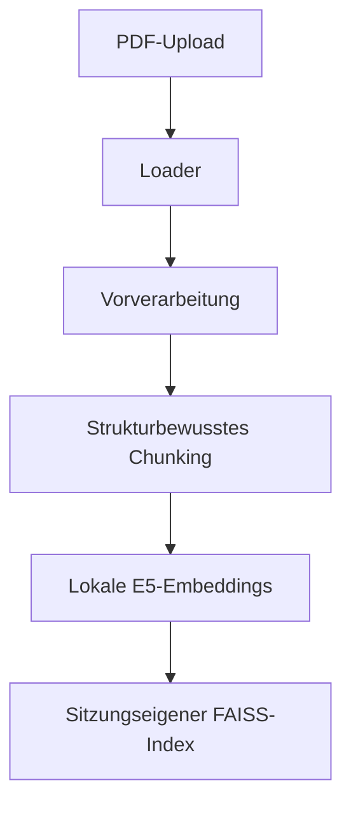
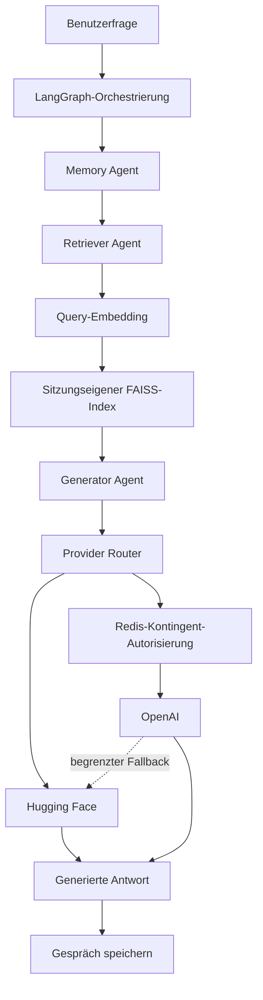

[Open interactive Streamlit demo](https://rinovative-nlp-multiagent-rag.streamlit.app/)  
_Interaktive Web-App direkt im Browser öffnen (via Streamlit Cloud)_

# NLP Multi-Agent RAG (Wahlfachprojekt)

**Wahlfachprojekt** im Rahmen des Studiengangs  
**BSc Systemtechnik – Vertiefung Computational Engineering**  
**Frühjahr 2025** – OST – Ostschweizer Fachhochschule  
**Autor:** Rino Albertin  

---

## 📌 Projektbeschreibung

Dieses Wahlfachprojekt beantwortet Fragen zu hochgeladenen PDF-Dokumenten mit einer mehrsprachigen Retrieval-Augmented-Generation-Pipeline (RAG). Die Dokumente werden strukturbewusst verarbeitet und in überlappende Chunks zerlegt. Lokale Embeddings mit `intfloat/multilingual-e5-small` erschliessen den Inhalt für die semantische Suche in einem sitzungseigenen FAISS-Index.

LangGraph orchestriert drei klar getrennte Rollen: Der Retriever Agent sucht relevante Textstellen, der Memory Agent stellt den Gesprächskontext bereit und der Generator Agent formuliert die Antwort. Die Generierung erfolgt kostenlos über Hugging Face Inference Providers oder optional über OpenAI. Jeder OpenAI-Aufruf wird zuvor atomar durch ein Redis-basiertes Kontingent autorisiert. Browser-Sitzungen halten Uploads, Vektoren und Gesprächsverlauf voneinander getrennt.

<details>
<summary><strong>Dokumentverarbeitung und Chunking</strong></summary>

- `pdfplumber` extrahiert Text, Seiten- und Layoutinformationen direkt aus PDF-Dateien.
- Die Vorverarbeitung normalisiert Text, erkennt wiederkehrende Kopf- und Fusszeilen und leitet typografische Strukturmerkmale ab.
- Der eigene Chunker erhält Dokument-, Seiten-, Abschnitts- und Positionsmetadaten und bildet reproduzierbare Chunk-IDs.
- Upload-Grössen, Dateityp und Texteingaben werden vor der Verarbeitung begrenzt und validiert.

Die strukturbezogene Segmentierung ist eine Implementierungseigenschaft; eine höhere Retrieval-Qualität gegenüber anderen Chunking-Verfahren wurde im Projekt nicht experimentell nachgewiesen.

</details>

<details>
<summary><strong>Embeddings und semantische Suche</strong></summary>

- `SentenceTransformers` lädt das mehrsprachige Modell `intfloat/multilingual-e5-small` lokal und unabhängig vom gewählten Generierungsanbieter.
- E5-konforme Präfixe unterscheiden Dokument- und Anfrage-Embeddings.
- FAISS speichert Vektoren und zugehörige Metadaten in eindeutiger Positionsreihenfolge und liefert die nächsten Treffer per L2-Distanz.
- Persistierte FAISS-Snapshots werden vollständig versioniert; beim Laden werden Schema, Embedding-Modell, Dimension, Index und Datensätze validiert.

</details>

<details>
<summary><strong>Multi-Agent-Orchestrierung</strong></summary>

Der feste LangGraph-Ablauf lädt zuerst den sitzungsspezifischen Verlauf, führt danach das Retrieval aus, generiert genau eine Antwort und speichert abschliessend den neuen Dialogzug. Die Streamlit-Oberfläche bleibt eine dünne Grenze; Verarbeitung, Retrieval, Speicher und Provider-Routing liegen in typisierten Anwendungskomponenten.

</details>

<details>
<summary><strong>Modellwahl und OpenAI-Kontingentschutz</strong></summary>

`GENERATION_PROVIDER` unterstützt drei Modi:

| Modus | Verhalten |
| --- | --- |
| `huggingface` | Verwendet ausschliesslich die konfigurierte Hugging-Face-Generierung. |
| `auto` | Verwendet OpenAI, wenn Schlüssel und Redis-Kontingent verfügbar sind; andernfalls oder bei begrenzten temporären Fehlern erfolgt ein einmaliger Hugging-Face-Fallback. Ohne OpenAI-Konfiguration wird direkt Hugging Face verwendet. |
| `openai` | Verwendet den kontingentgeschützten OpenAI-Pfad. Ein Hugging-Face-Fallback ist nur mit `OPENAI_FALLBACK_ENABLED=true` aktiv. |

Das Redis-Backend reserviert Anfragen und Token atomar per Lua-Skript. Es begrenzt Tages-, Monats- und Sitzungsnutzung und kann vom Betreiber sofort deaktiviert werden. Ist Redis nicht erreichbar, wird keine neue OpenAI-Nutzung unkontrolliert freigegeben; je nach Modus wird sicher abgebrochen oder auf Hugging Face zurückgefallen. Öffentliche Besucher geben niemals API-Schlüssel ein.

</details>

<details>
<summary><strong>Session-Isolation und Persistenz</strong></summary>

Jede Streamlit-Browser-Sitzung besitzt eine eigene Sitzungs-ID, ein eigenes Upload-Set, einen eigenen FAISS-Speicher und einen eigenen Gesprächsverlauf. Ein neues Upload-Set wird erst nach vollständig erfolgreicher Verarbeitung atomar aktiviert. Die Web-App arbeitet sitzungsbezogen im Arbeitsspeicher; die FAISS-Komponente unterstützt zusätzlich validierte, atomar umgeschaltete Snapshot-Generationen für explizit konfigurierte Speicherpfade.

</details>

<details>
<summary><strong>Qualitätssicherung</strong></summary>

Die deterministische Testsuite deckt unter anderem Importgrenzen, Konfiguration, PDF-Verarbeitung, Chunking, Embeddings, FAISS, Provider-Routing, Kontingente, CLI, Sitzungsisolation und die Streamlit-Grenze ab. Black, Ruff und Mypy sind als Entwicklungsprüfungen konfiguriert; die CI führt dieselben Kernprüfungen unter Python 3.12 aus.

</details>

---

## 📄 Projektbericht

Der [ursprüngliche akademische Projektbericht](docs/Albertin_Rino_NLP_Projekt.pdf) dokumentiert Problemstellung, Grundlagen und den Entwicklungsstand des Wahlfachprojekts im Frühjahr 2025. Für den aktuellen ausführbaren Stand sind der Quellcode und diese README massgebend.

---

## 🧭 Architektur und Datenfluss

Die Anwendung trennt Dokumentaufnahme und Fragebeantwortung. Beide Abläufe teilen sich den sitzungseigenen FAISS-Speicher und das lokale Embedding-Modell.

<details>
<summary><strong>Vertikale Architekturdiagramme anzeigen</strong></summary>

### Dokumentaufnahme



### Fragebeantwortung



</details>

---

## ⚙️ Lokale Ausführung

<details>
<summary><strong>Empfohlen: Poetry und Hugging Face</strong></summary>

Voraussetzungen sind Git, Python 3.12 und Poetry 2.x. Die kostenlose Generierungsroute benötigt ein persönliches Hugging-Face-Token; die lokalen Embeddings benötigen keinen API-Schlüssel.

```bash
git clone https://github.com/Rinovative/nlp-multiagent-rag.git
cd nlp-multiagent-rag
poetry install --with dev
cp .env.template .env
```

Unter PowerShell lautet der Kopierbefehl:

```powershell
Copy-Item .env.template .env
```

Mindestens diese Werte in `.env` setzen:

```dotenv
GENERATION_PROVIDER=huggingface
HUGGINGFACE_API_TOKEN=eigenes_huggingface_token
```

Den Token-Platzhalter durch das eigene Hugging-Face-Token ersetzen.

Anwendung aus dem Repository-Stamm starten:

```bash
poetry run streamlit run app.py
```

</details>

<details>
<summary><strong>Streamlit Community Cloud bereitstellen</strong></summary>

1. In Streamlit Community Cloud das Repository `Rinovative/nlp-multiagent-rag`, den Branch `main` und den Einstiegspunkt `app.py` wählen.
2. In den erweiterten Einstellungen Python 3.12 wählen. Community Cloud erkennt das `pyproject.toml` als Poetry-Abhängigkeitsdatei; die synchronisierte `poetry.lock` liegt daneben im Repository-Stamm.
3. Im Bereich **Secrets** mindestens `GENERATION_PROVIDER` und `HUGGINGFACE_API_TOKEN` hinterlegen. Das Modell kann optional mit `HUGGINGFACE_GENERATION_MODEL` angepasst werden.
4. Für den optionalen OpenAI-Pfad zusätzlich `OPENAI_API_KEY`, `REDIS_URL` und die gewünschte Routing-Konfiguration setzen.
5. Deployment-Logs prüfen und danach Upload, Retrieval und eine vollständige Antwort in einer Test-Sitzung validieren.

Geheimnisse gehören ausschliesslich in die Streamlit-Secrets und dürfen weder in Git noch in die README oder in Logausgaben übernommen werden. Der oben verlinkte öffentliche Endpunkt ist erreichbar; die Neubereitstellung dieses Quellstands wird separat in Streamlit Community Cloud validiert.

</details>

<details>
<summary><strong>Optionale OpenAI-, Redis- und Laufzeitkonfiguration</strong></summary>

Die Vorlage [`.env.template`](.env.template) enthält sämtliche unterstützten Werte:

| Variable | Zweck | Standard oder Pflicht |
| --- | --- | --- |
| `GENERATION_PROVIDER` | Route `auto`, `huggingface` oder `openai` | `auto` |
| `HUGGINGFACE_API_TOKEN` | Token für Hugging Face Inference Providers | Für jede verwendete Hugging-Face-Route erforderlich |
| `HUGGINGFACE_GENERATION_MODEL` | Hosted-Generation-Modell | `Qwen/Qwen2.5-7B-Instruct` |
| `OPENAI_API_KEY` | Betreiber-Schlüssel für OpenAI | Nur für OpenAI erforderlich |
| `OPENAI_GENERATION_MODEL` | OpenAI-Modell | `gpt-4o-mini` |
| `OPENAI_FALLBACK_ENABLED` | Erlaubt im Modus `openai` einen begrenzten Hugging-Face-Fallback | `false` |
| `REDIS_URL` | Redis-Verbindung für atomare OpenAI-Kontingente | Für OpenAI erforderlich |
| `OPENAI_QUOTA_KEY_PREFIX` | Namensraum der Kontingentschlüssel | `nlp-rag:{openai-quota}` |
| `EMBEDDING_MODEL` | Lokales SentenceTransformers-Modell | `intfloat/multilingual-e5-small` |
| `EMBEDDING_DIMENSION` | Erwartete Vektordimension | `384` |
| `EMBEDDING_BATCH_SIZE` | Batch-Grösse der Embeddings | `32` |
| `MAX_UPLOAD_MB` | Gesamtgrösse des aktiven Upload-Sets | `20` |
| `MAX_INPUT_CHARACTERS` | Maximale Länge der Frage | `24000` |
| `MAX_OUTPUT_TOKENS` | Maximale Generierungslänge | `512` |
| `MAX_HISTORY_MESSAGES` | Anzahl berücksichtigter Verlaufsnachrichten | `10` |
| `RETRIEVAL_TOP_K` | Anzahl abgerufener Chunks | `5` |
| `PROVIDER_TIMEOUT_SECONDS` | Zeitlimit pro Provider-Aufruf | `45` |

`auto` ist für eine öffentliche Installation mit optionalem OpenAI-Zugang vorgesehen: Ohne konfigurierten OpenAI-Schlüssel wird Hugging Face verwendet. Sobald OpenAI konfiguriert ist, muss Redis dessen Verwendung autorisieren. Besucher sehen oder erfassen die Betreiber-Schlüssel nicht.

</details>

<details>
<summary><strong>OpenAI-Kontingent administrieren</strong></summary>

Die Betreiber-CLI liest `REDIS_URL` aus `.env` oder akzeptiert `--redis-url`. Sie gibt keine Redis-Zugangsdaten aus.

```bash
poetry run python -m src.cli.cli_quota inspect
poetry run python -m src.cli.cli_quota set-limits --daily-requests 100 --monthly-requests 1000 --daily-tokens 100000 --monthly-tokens 1000000 --session-requests 10 --session-window-seconds 3600
poetry run python -m src.cli.cli_quota disable
poetry run python -m src.cli.cli_quota enable
```

</details>

---

## 📂 Projektstruktur

<details>
<summary><strong>Projektstruktur anzeigen</strong></summary>

```text
.
├── .github/
│   └── workflows/
│       └── ci.yml                                  # CI für Formatierung, Linting, Typen und Tests
├── docs/
│   └── Albertin_Rino_NLP_Projekt.pdf              # Ursprünglicher akademischer Projektbericht
├── src/
│   ├── agents/
│   │   ├── __init__.py                            # Öffentliche Agent-Schnittstellen
│   │   ├── agents_generator.py                    # Antwortgenerierung aus Kontext und Verlauf
│   │   ├── agents_memory.py                       # Zugriff auf den Gesprächsspeicher
│   │   └── agents_retriever.py                    # Anfrage-Embedding und Dokumentabruf
│   ├── application/
│   │   ├── __init__.py                            # Öffentliche Anwendungsschnittstellen
│   │   ├── application_factory.py                 # Verdrahtung von Providern, Agenten und Sitzungen
│   │   └── application_session.py                 # Atomare Upload- und Sitzungsverwaltung
│   ├── cli/
│   │   ├── __init__.py                            # CLI-Paketgrenze
│   │   └── cli_quota.py                           # Betreiber-CLI für OpenAI-Kontingente
│   ├── configuration/
│   │   ├── __init__.py                            # Öffentliche Konfigurationsschnittstellen
│   │   └── configuration_runtime.py               # Validierte Umgebungs- und Secret-Konfiguration
│   ├── embeddings/
│   │   ├── __init__.py                            # Öffentliche Embedding-Schnittstellen
│   │   ├── embeddings_chunks.py                   # Embedding-Anreicherung von Chunks
│   │   ├── embeddings_contracts.py                # Typisierte Provider-Verträge
│   │   └── embeddings_sentence_transformer.py     # Lokaler SentenceTransformers-Provider
│   ├── ingestion/
│   │   ├── __init__.py                            # Öffentliche Ingestion-Schnittstellen
│   │   ├── ingestion_chunker.py                   # Strukturbewusstes Chunking
│   │   ├── ingestion_loader.py                    # PDF-Extraktion mit pdfplumber
│   │   ├── ingestion_preprocessing.py             # Text- und Layout-Vorverarbeitung
│   │   └── ingestion_processor.py                 # Orchestrierung der Dokumentaufnahme
│   ├── memory/
│   │   ├── __init__.py                            # Öffentliche Memory-Schnittstellen
│   │   ├── memory_contracts.py                    # Vertrag für Gesprächsspeicher
│   │   └── memory_in_memory.py                    # Sitzungsspezifischer Arbeitsspeicher
│   ├── orchestration/
│   │   ├── __init__.py                            # Öffentliche Orchestrierungsoberfläche
│   │   └── orchestration_rag.py                   # Typisierter LangGraph-RAG-Ablauf
│   ├── providers/
│   │   ├── __init__.py                            # Öffentliche Provider-Schnittstellen
│   │   ├── providers_contracts.py                 # Ergebnisse, Fehler und Provider-Verträge
│   │   ├── providers_generation_huggingface.py    # Hugging-Face-Generierungsprovider
│   │   ├── providers_generation_openai.py         # OpenAI-Generierungsprovider
│   │   └── providers_router.py                     # Routing, Kontingente und begrenzter Fallback
│   ├── quota/
│   │   ├── __init__.py                            # Öffentliche Kontingent-Schnittstellen
│   │   ├── quota_contracts.py                     # Limits, Reservierungen und Fehler
│   │   ├── quota_memory.py                        # Deterministisches In-Memory-Backend
│   │   └── quota_redis.py                         # Atomares Redis-Backend mit Lua
│   ├── vectorstore/
│   │   ├── __init__.py                            # Öffentliche Vektorspeicher-Schnittstellen
│   │   └── vectorstore_faiss.py                   # FAISS-Suche und validierte Snapshots
│   └── __init__.py                                # Importierbares Top-Level-Paket
├── tests/
│   ├── ingestion/
│   │   ├── __init__.py                            # Ingestion-Testpaket
│   │   ├── test_chunker.py                        # Chunk-Schema und Strukturtests
│   │   ├── test_embedder.py                       # Embedding-Verträge und Batch-Verhalten
│   │   ├── test_loader.py                         # PDF-Ladetests
│   │   └── test_preprocessing.py                  # Text- und Layoutbereinigung
│   ├── providers/
│   │   ├── __init__.py                            # Provider-Testpaket
│   │   ├── test_generation_providers.py           # OpenAI- und Hugging-Face-Adapter
│   │   ├── test_generator.py                      # Generator Agent
│   │   ├── test_retriever.py                      # Retriever Agent
│   │   └── test_router.py                         # Routing- und Fallback-Regeln
│   ├── quota/
│   │   ├── __init__.py                            # Kontingent-Testpaket
│   │   ├── test_cli.py                            # Betreiber-CLI
│   │   └── test_quota.py                          # Limits, Atomizität und Fehlerfälle
│   ├── vectorstore/
│   │   ├── __init__.py                            # Vektorspeicher-Testpaket
│   │   └── test_faiss_store.py                    # Suche, Validierung und Snapshots
│   ├── __init__.py                                # Testpaket
│   ├── conftest.py                                # Gemeinsame deterministische Fixtures
│   ├── test_app.py                                # Streamlit-Grenze ohne Zugangsdaten
│   ├── test_architecture.py                       # Import- und Architekturverträge
│   ├── test_config.py                             # Konfigurationsvalidierung
│   ├── test_pipeline.py                           # Ingestion- und RAG-Integration
│   └── test_session.py                            # Isolation und Upload-Lebenszyklus
├── .env.template                                  # Dokumentierte Konfigurationsvorlage
├── .gitignore                                     # Ausgeschlossene lokale Artefakte
├── .pre-commit-config.yaml                        # Lokale Qualitätsprüfungen
├── app.py                                         # Streamlit-Einstiegspunkt im Repository-Stamm
├── LICENSE                                        # MIT-Lizenz
├── poetry.lock                                    # Aufgelöste Abhängigkeiten
├── pyproject.toml                                 # Projekt-, Tool- und Abhängigkeitskonfiguration
└── README.md                                      # Projektdokumentation
```

</details>

---

## 📄 Lizenz

Dieses Projekt steht unter der [MIT-Lizenz](LICENSE).

---

## 📚 Quellen und Referenzen

- Lehrunterlagen des OST-Wahlfachs **Natural Language Processing**, Frühjahr 2025 (interne Kursunterlagen).
- Lewis, P. et al. (2020): [Retrieval-Augmented Generation for Knowledge-Intensive NLP Tasks](https://proceedings.neurips.cc/paper/2020/hash/6b493230205f780e1bc26945df7481e5-Abstract.html).
- [LangGraph – Dokumentation](https://docs.langchain.com/oss/python/langgraph/overview).
- [FAISS – offizielle Dokumentation und Quellcode](https://github.com/facebookresearch/faiss).
- [SentenceTransformers – Dokumentation](https://www.sbert.net/).
- [Modellkarte `intfloat/multilingual-e5-small`](https://huggingface.co/intfloat/multilingual-e5-small).
- [Hugging Face Inference Providers – Dokumentation](https://huggingface.co/docs/inference-providers/index) und [Modellkarte `Qwen/Qwen2.5-7B-Instruct`](https://huggingface.co/Qwen/Qwen2.5-7B-Instruct).
- [OpenAI API – Dokumentation](https://developers.openai.com/api/docs).
- [Redis Lua Scripting – Dokumentation](https://redis.io/docs/latest/develop/interact/programmability/eval-intro/).
- [Streamlit Community Cloud – Dokumentation](https://docs.streamlit.io/deploy/streamlit-community-cloud).
