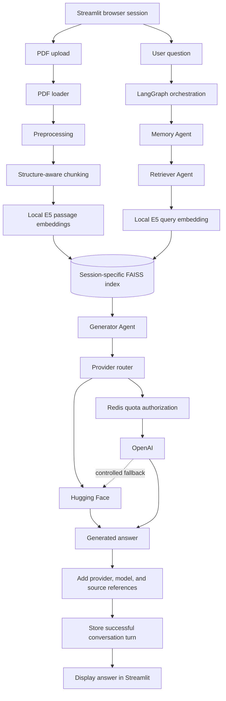

[](https://nlp-multiagent-rag.streamlit.app/)  
_Open the interactive PDF assistant directly in your browser via Streamlit Community Cloud_

# PDF RAG Assistant with Multi-Agent Orchestration
### *Elective Project Natural Language Processing – BSc Systems Engineering, Spring 2025*

Bachelor of Science in Systems Engineering – Computational Engineering  
OST – Eastern Switzerland University of Applied Sciences  
**Author:** Rino M. Albertin

## 📌 Project Overview

This project implements a retrieval-augmented generation system for question answering over user-provided PDF documents.

Visitors can upload their own PDFs and ask questions about their content through the public `PDF RAG Assistant`. Each browser session maintains an isolated document collection, FAISS index, and conversation history. LangGraph orchestrates document retrieval, conversational context, and answer generation.

The system combines local semantic retrieval with externally hosted language models. OpenAI usage is protected by Redis-based application quotas, while Hugging Face Inference Providers serve as the independent generation route and controlled fallback.

<details>
<summary><strong>🎯 Project scope</strong></summary>

The current public demo focuses on temporary document-chat sessions:

1. **Document upload**  
   Visitors can upload up to ten PDFs, with a maximum of 64 MB per file and 128 MB per active selection.

2. **Document processing**  
   PDF text and layout information are extracted, preprocessed, segmented into deterministic chunks, and embedded locally.

3. **Semantic retrieval**  
   Questions are embedded with the same E5 model and matched against a session-specific FAISS index.

4. **Answer generation**  
   A provider router selects quota-protected OpenAI or Hugging Face according to the configured operating mode.

5. **Grounded presentation**  
   Successful answers identify the provider and model used and include ordered document and page references.

The application keeps uploaded documents and conversation state in session memory and does not persist them as a durable server-side archive.

</details>

## 🧱 Project Components

The repository is organized around the following components

<details>
<summary><strong>📄 Document processing and chunking</strong></summary>

`pdfplumber` extracts text, page information, and layout metadata directly from uploaded PDF bytes.

The preprocessing layer:

- normalizes extracted text
- identifies recurring headers and footers
- derives typographic structure
- distinguishes paragraphs, headings, captions, pseudo-tables, and tables

Structural units containing no more than 1,000 Unicode characters remain unchanged. Longer units are divided deterministically into parts with an overlap of 200 characters. Independent structural units are not joined or automatically overlapped.

Chunk identifiers and metadata retain document, source, sequence, page, and part information where available.

</details>

<details>
<summary><strong>🔎 Embeddings and semantic retrieval</strong></summary>

The project uses `intfloat/multilingual-e5-small` through SentenceTransformers for local document and query embeddings.

E5-compatible prefixes distinguish the two embedding roles:

- `passage:` for document chunks
- `query:` for user questions

The multilingual embedding space can support semantic matches across languages. It does not translate documents, perform explicit language detection, or guarantee equal retrieval quality for every language.

Each browser session owns a separate FAISS index. Search results preserve their associated chunk text and typed metadata. Explicitly persisted FAISS snapshots include the index, records, schema version, embedding model, and vector dimension. A new snapshot is validated completely before the store switches to it.

</details>

<details>
<summary><strong>🧠 Multi-agent orchestration</strong></summary>

LangGraph coordinates three specialized roles in a fixed workflow:

1. **Memory Agent**  
   Loads the conversation history belonging to the current browser session.

2. **Retriever Agent**  
   Embeds the current question and retrieves relevant chunks from the active FAISS index.

3. **Generator Agent**  
   Constructs a bounded grounded request and delegates answer generation to the configured provider router.

After successful generation, the new interaction is added to the session history. The result includes the provider, model, fallback status, and ordered source references without performing a second retrieval for presentation.

These roles form a structured RAG workflow. They are not independent autonomous agents and do not modify the uploaded documents or provider configuration.

</details>

<details>
<summary><strong>🔒 Session and upload isolation</strong></summary>

Every Streamlit browser session receives an independent identifier and owns:

- its active upload selection
- its document identities
- its FAISS index
- its conversation history
- its application-session state

Uploaded files are identified by their content hash rather than by filename. Two different files with the same filename therefore cannot collide.

Changed upload selections are validated before extraction, chunking, or embedding. The current document set remains active while a new selection is processed. It is replaced only after every selected document has been processed successfully, so a failed upload cannot discard an existing valid session state.

Session data remains in application memory and is not a permanent server-side document archive.

</details>

<details>
<summary><strong>🔀 Provider routing and quota protection</strong></summary>

`GENERATION_PROVIDER` defines the generation route:

- **`huggingface`** uses only the configured Hugging Face provider
- **`auto`** uses OpenAI when it is configured and authorized by Redis. Otherwise, or after selected quota and temporary provider failures, it attempts Hugging Face once
- **`openai`** uses the quota-protected OpenAI route and enables Hugging Face fallback only when `OPENAI_FALLBACK_ENABLED=true`

The default generation models are:

- `Qwen/Qwen2.5-7B-Instruct` through Hugging Face Inference Providers
- `gpt-5.4-mini` through OpenAI Chat Completions

Redis reserves OpenAI requests and tokens atomically through a Lua script. Limits can be enforced per session, day, and month. Failed authorization keeps OpenAI disabled for that request, preventing uncontrolled paid usage.

Hugging Face generation remains dependent on valid authentication, available inference credits, model availability, provider capacity, and external service health. A configured fallback therefore cannot guarantee that every request receives an answer.

</details>

<details>
<summary><strong>📋 Quality assurance</strong></summary>

The deterministic test suite protects the central application contracts, including:

- PDF extraction and preprocessing
- structural chunking and overlap
- E5 embedding prefixes and dimensions
- FAISS search and snapshot integrity
- upload limits and all-or-nothing document-set replacement
- browser-session isolation
- provider routing and categorized failures
- Redis quota reservation and reconciliation
- Streamlit startup and safe error presentation
- import-time side-effect boundaries

The continuous-integration workflow validates formatting, static analysis, type safety, dependency consistency, and the complete test suite under Python 3.12.

</details>

<details>
<summary><strong>🧭 Architecture and data flow</strong></summary>



</details>

## 📊 Results

### 🌐 Public Demo

The deployed Streamlit application provides an end-to-end document-chat workflow:

1. upload one or more PDFs
2. process and index the active document selection
3. ask questions about the indexed content
4. receive an answer with provider and model attribution
5. inspect the referenced documents and pages

The demo is available at:
[https://nlp-multiagent-rag.streamlit.app/](https://nlp-multiagent-rag.streamlit.app/)

### 📄 Project Report

The [original academic project report](docs/Albertin_Rino_NLP_Projekt.pdf) documents the problem statement, theoretical foundations, and development status of the course project in spring 2025.

The source code and this README describe the current executable version of the application.

## ⚙️ Local and Cloud Execution

<details>
<summary><strong>Local Poetry workflow</strong></summary>

1. Clone the repository:

```bash
git clone https://github.com/Rinovative/nlp-multiagent-rag.git
cd nlp-multiagent-rag
```

2. Install the project and development dependencies:

```bash
poetry install --with dev
```

3. Create the local environment file:

```bash
cp .env.template .env
```

PowerShell alternative:

```powershell
Copy-Item .env.template .env
```

4. Configure at least the Hugging Face generation route in `.env`:

```dotenv
GENERATION_PROVIDER=huggingface
HUGGINGFACE_API_TOKEN=your_huggingface_token
```

The token requires the **Make calls to Inference Providers** permission. Local E5 embeddings do not require an API key.

5. Start the application from the repository root:

```bash
poetry run streamlit run app.py
```

6. Open the local Streamlit address displayed in the terminal.

All supported settings and their defaults are documented in [`.env.template`](.env.template).

</details>

<details>
<summary><strong>Streamlit Community Cloud deployment</strong></summary>

1. Create a Streamlit Community Cloud application using:

```text
Repository: Rinovative/nlp-multiagent-rag
Branch: main
Entry point: app.py
Python: 3.12
```

2. Add the required operator settings under **App settings → Secrets**.

Minimal Hugging Face configuration:

```toml
GENERATION_PROVIDER = "huggingface"
HUGGINGFACE_API_TOKEN = "<HUGGINGFACE_INFERENCE_TOKEN>"
```

Configuration with quota-protected OpenAI and Hugging Face fallback:

```toml
GENERATION_PROVIDER = "auto"

HUGGINGFACE_API_TOKEN = "<HUGGINGFACE_INFERENCE_TOKEN>"

OPENAI_API_KEY = "<OPENAI_PROJECT_API_KEY>"
REDIS_URL = "<TLS_REDIS_URL>"
OPENAI_QUOTA_KEY_PREFIX = "nlp-rag:{openai-quota}:prod"
```

3. Save the secrets and reboot the Streamlit application.

Secrets must never be committed to Git, copied into the README, or exposed through application errors.

</details>

<details>
<summary><strong>OpenAI quota administration</strong></summary>

The quota CLI reads `REDIS_URL` from the local `.env` file or accepts an explicit `--redis-url` argument. Its key prefix must match the application’s configured `OPENAI_QUOTA_KEY_PREFIX`.

1. Store the production limits:

```bash
poetry run python -m src.cli.cli_quota \
  --key-prefix 'nlp-rag:{openai-quota}:prod' \
  set-limits \
  --daily-requests 30 \
  --monthly-requests 300 \
  --daily-tokens 100000 \
  --monthly-tokens 1000000 \
  --session-requests 5 \
  --session-window-seconds 3600
```
PowerShell uses backticks [`] instead of backslashes

1. Enable the quota-protected OpenAI route:

```bash
poetry run python -m src.cli.cli_quota --key-prefix 'nlp-rag:{openai-quota}:prod' enable
```

The current limits and usage can be displayed with `inspect` and OpenAI authorizations can be stopped immediately with `disable`:

```bash
poetry run python -m src.cli.cli_quota --key-prefix 'nlp-rag:{openai-quota}:prod' inspect
poetry run python -m src.cli.cli_quota --key-prefix 'nlp-rag:{openai-quota}:prod' disable
```

The CLI reports quota state without printing Redis credentials.

</details>

## 📂 Repository Structure

<details>
<summary><strong>Show repository structure</strong></summary>

```text
.
├── .github/
│   └── workflows/
│       └── ci.yml                                 # Formatting, linting, typing, and tests
│
├── docs/
│   └── Albertin_Rino_NLP_Projekt.pdf              # Original academic project report
│
├── src/
│   ├── agents/
│   │   ├── __init__.py  
│   │   ├── agents_generator.py                    # Grounded answer generation
│   │   ├── agents_memory.py                       # Conversation-memory access
│   │   └── agents_retriever.py                    # Query embedding and retrieval
│   ├── application/
│   │   ├── __init__.py  
│   │   ├── application_factory.py                 # Application dependency construction
│   │   └── application_session.py                 # Upload and session management
│   ├── cli/
│   │   ├── __init__.py  
│   │   └── cli_quota.py                           # Operator quota administration
│   ├── configuration/
│   │   ├── __init__.py  
│   │   └── configuration_runtime.py               # Environment and secret configuration
│   ├── embeddings/
│   │   ├── __init__.py  
│   │   ├── embeddings_chunks.py                   # Chunk embedding enrichment
│   │   ├── embeddings_contracts.py                # Embedding contracts
│   │   └── embeddings_sentence_transformer.py     # Local SentenceTransformers provider
│   ├── ingestion/
│   │   ├── __init__.py  
│   │   ├── ingestion_chunker.py                   # Structure-aware chunking
│   │   ├── ingestion_loader.py                    # PDF extraction with pdfplumber
│   │   ├── ingestion_preprocessing.py             # Text and layout preprocessing
│   │   └── ingestion_processor.py                 # Document-ingestion orchestration
│   ├── memory/
│   │   ├── __init__.py  
│   │   ├── memory_contracts.py                    # Conversation-store contract
│   │   └── memory_in_memory.py                    # Session-specific in-memory store
│   ├── orchestration/
│   │   ├── __init__.py  
│   │   └── orchestration_rag.py                   # Typed LangGraph RAG workflow
│   ├── providers/
│   │   ├── __init__.py  
│   │   ├── providers_contracts.py                 # Provider results, errors, and contracts
│   │   ├── providers_generation_huggingface.py    # Hugging Face generation provider
│   │   ├── providers_generation_openai.py         # OpenAI generation provider
│   │   └── providers_router.py                    # Routing, quotas, and controlled fallback
│   ├── quota/
│   │   ├── __init__.py  
│   │   ├── quota_contracts.py                     # Limits, reservations, and errors
│   │   ├── quota_memory.py                        # Deterministic in-memory backend
│   │   └── quota_redis.py                         # Atomic Redis backend using Lua
│   ├── vectorstore/
│   │   ├── __init__.py  
│   │   └── vectorstore_faiss.py                   # FAISS search and validated snapshots
│   └── __init__.py                                # Importable top-level package
│
├── tests/                                         # Unit, integration, and boundary tests
│
├── .env.template                                  # Documented configuration template
├── .gitignore                                     # Excluded local artifacts
├── .pre-commit-config.yaml                        # Local quality checks
├── LICENSE                                        # MIT license
├── README.md                                      # Project overview and instructions
├── app.py                                         # Streamlit entry point
├── poetry.lock                                    # Locked dependencies
└── pyproject.toml                                 # Project and tool configuration
```

</details>

## 📄 License

This project is released under the [MIT License](LICENSE).

## 📚 References

- Shao Jü Woo, **“Natural Language Processing (NLP) Project Description”**, OST – Eastern Switzerland University of Applied Sciences, spring semester 2025. Internal course document
- P. Lewis et al., [**“Retrieval-Augmented Generation for Knowledge-Intensive NLP Tasks”**](https://proceedings.neurips.cc/paper/2020/hash/6b493230205f780e1bc26945df7481e5-Abstract.html), *Advances in Neural Information Processing Systems*, 2020
- P. Pandey, [**“Building Advanced AI Agents with LangGraph: Enhancing Your LLM Applications”**](https://medium.com/@pankaj_pandey/building-advanced-ai-agents-with-langgraph-enhancing-your-llm-applications-c43c6803a9d2), *Medium*, December 8, 2024
- D. Jain, [**“Building Agentic RAG with DeepSeek R1 and Qwen”**](https://medium.com/@deepujain/building-agentic-rag-with-deepseek-r1-and-qwen-64f15fdb253d), *Medium*, February 4, 2025
- K. E. Chen, [**“Using DeepSeek R1 for RAG: Do’s and Don’ts”**](https://skypilot.ai/blog/deepseek-rag), *SkyPilot Blog*, February 26, 2025
- [LangGraph Documentation](https://docs.langchain.com/oss/python/langgraph/overview)
- [FAISS Documentation and Source Code](https://github.com/facebookresearch/faiss)
- [SentenceTransformers Documentation](https://www.sbert.net/)
- [`intfloat/multilingual-e5-small` Model Card](https://huggingface.co/intfloat/multilingual-e5-small)
- [Hugging Face Inference Providers Documentation](https://huggingface.co/docs/inference-providers/index)
- [`Qwen/Qwen2.5-7B-Instruct` Model Card](https://huggingface.co/Qwen/Qwen2.5-7B-Instruct)
- [OpenAI Chat Completions API Reference](https://developers.openai.com/api/reference/chat-completions/overview/)
- [`gpt-5.4-mini` Model Documentation](https://developers.openai.com/api/docs/models/gpt-5.4-mini)
- [Redis Lua Scripting Documentation](https://redis.io/docs/latest/develop/interact/programmability/eval-intro/)
- [Streamlit Community Cloud Documentation](https://docs.streamlit.io/deploy/streamlit-community-cloud)
